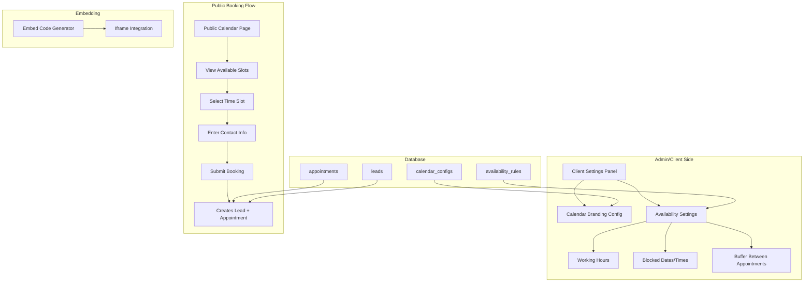

# Shareable & Embeddable Calendar System Plan

## Overview
Create a system where clients can share a booking calendar that prospects can view and book appointments directly. The calendar syncs with existing leads and appointments.

## Architecture



---

## Database Schema Changes

### 1. Calendar Configuration Table
```sql
CREATE TABLE public.calendar_configs (
    id UUID PRIMARY KEY DEFAULT gen_random_uuid(),
    client_id UUID REFERENCES public.clients(id) ON DELETE CASCADE,
    
    -- Branding
    logo_url TEXT,
    company_name TEXT,
    primary_color TEXT DEFAULT '#000000',
    secondary_color TEXT DEFAULT '#ffffff',
    
    -- Display Settings
    calendar_title TEXT,
    description TEXT,
    show_company_logo BOOLEAN DEFAULT true,
    timezone TEXT DEFAULT 'Africa/Tripoli',
    
    -- Booking Settings
    allow_cancellation BOOLEAN DEFAULT true,
    require_confirmation BOOLEAN DEFAULT true,
    show_location BOOLEAN DEFAULT true,
    custom_location TEXT,
    
    -- Sharing
    share_token UUID UNIQUE,
    is_public BOOLEAN DEFAULT false,
    embed_enabled BOOLEAN DEFAULT true,
    
    created_at TIMESTAMP WITH TIME ZONE DEFAULT now(),
    updated_at TIMESTAMP WITH TIME ZONE DEFAULT now()
);
```

### 2. Availability Rules Table
```sql
CREATE TABLE public.availability_rules (
    id UUID PRIMARY KEY DEFAULT gen_random_uuid(),
    calendar_config_id UUID REFERENCES public.calendar_configs(id) ON DELETE CASCADE,
    
    -- Day of week (0=Sunday, 6=Saturday)
    day_of_week INTEGER CHECK (day_of_week >= 0 AND day_of_week <= 6),
    
    -- Time range
    start_time TIME NOT NULL,
    end_time TIME NOT NULL,
    
    -- Is this slot available or blocked?
    is_available BOOLEAN DEFAULT true,
    
    -- Specific date (optional, for exceptions)
    specific_date DATE,
    
    created_at TIMESTAMP WITH TIME ZONE DEFAULT now()
);
```

### 3. Booking Types Table (Optional Service Types)
```sql
CREATE TABLE public.booking_types (
    id UUID PRIMARY KEY DEFAULT gen_random_uuid(),
    calendar_config_id UUID REFERENCES public.calendar_configs(id) ON DELETE CASCADE,
    
    name TEXT NOT NULL,
    description TEXT,
    duration_minutes INTEGER NOT NULL DEFAULT 30,
    is_active BOOLEAN DEFAULT true,
    
    created_at TIMESTAMP WITH TIME ZONE DEFAULT now()
);
```

---

## Frontend Implementation Plan

### Phase 1: Settings Panel for Clients
- [ ] **Calendar Settings Page** (`/settings/calendar`)
  - Branding section: logo upload, colors, company name
  - Display settings: title, description, timezone
  - Booking settings: confirmation required, cancellation allowed
  - Preview panel showing how calendar looks

- [ ] **Availability Editor Component**
  - Weekly schedule grid (Mon-Sun)
  - Time slot picker for each day
  - Add blocked dates/holidays
  - Buffer time between appointments setting
  - Exception dates (special hours)

### Phase 2: Public Calendar Page
- [ ] **Public Route** (`/book/:shareToken` or `/calendar/:calendarId`)
  - Read-only calendar showing available slots
  - Embed mode support (`?embed=true`)
  - Responsive design
  - Company branding displayed

- [ ] **Calendar View Component**
  - Month/Week/Day views
  - Highlight available vs booked slots
  - Time zone display/selection

- [ ] **Booking Form**
  - Select available time slot
  - Contact info form (name, phone, email)
  - Notes field
  - Booking type selection (if multiple)

### Phase 3: Booking Submission & Sync
- [ ] **Booking Submission Handler**
  - Validate slot is still available
  - Create new lead with status 'appointment_booked'
  - Create appointment linked to new lead
  - Send confirmation SMS (existing system)
  - Return confirmation to user

- [ ] **Real-time Availability**
  - Check slot availability before showing
  - Handle concurrent booking attempts
  - Lock slot briefly during booking process

### Phase 4: Embed Functionality
- [ ] **Embed Code Generator**
  - Generate iframe embed code
  - Customization options (height, width, theme)
  - Copy to clipboard button

- [ ] **Embed Mode Renderer**
  - Hide app header/sidebar
  - Minimal footer
  - Responsive iframe sizing
  - URL parameters for customization

---

## API Endpoints Needed

| Endpoint | Method | Description |
|----------|--------|-------------|
| `/api/calendar/config` | GET/POST/PUT | Get/Update calendar config |
| `/api/calendar/availability` | GET/POST | Get/Update availability rules |
| `/api/calendar/availability/bulk` | POST | Batch update availability |
| `/api/calendar/slots` | GET | Get available time slots for date range |
| `/api/calendar/book` | POST | Submit booking request |
| `/api/calendar/embed-code` | GET | Generate embed code |
| `/api/calendar/public/:token` | GET | Get public calendar data |

---

## Component Structure

```
src/
├── components/
│   ├── calendar/
│   │   ├── CalendarSettings.tsx       # Main settings panel
│   │   ├── AvailabilityEditor.tsx     # Weekly schedule editor
│   │   ├── BookingTypeManager.tsx     # Service type management
│   │   ├── BrandingPreview.tsx        # Live preview of calendar
│   │   ├── PublicCalendar.tsx         # Public-facing calendar
│   │   ├── AvailableSlots.tsx          # Time slot picker
│   │   ├── BookingForm.tsx             # Contact info form
│   │   └── EmbedCodeGenerator.tsx      # Embed code UI
│   └── layout/
│       └── CalendarLayout.tsx          # Layout for embed mode
├── pages/
│   ├── CalendarSettings.tsx           # Settings page route
│   ├── PublicBooking.tsx              # Public booking page
│   └── EmbedPreview.tsx               # Preview embed
├── services/
│   └── calendarService.ts             # Calendar API calls
└── lib/
    └── calendarUtils.ts                # Slot calculation, timezone utils
```

---

## Key Features Details

### 1. Availability Calculation Logic
```typescript
function calculateAvailableSlots(
    date: Date,
    rules: AvailabilityRule[],
    existingAppointments: Appointment[],
    bufferMinutes: number
): TimeSlot[] {
    // 1. Get working hours for the day
    // 2. Subtract existing appointments + buffer
    // 3. Return available time ranges
}
```

### 2. Embed Code Output
```html
<!-- Basic Embed -->
<iframe 
    src="https://yourapp.com/book/YOUR_TOKEN?embed=true" 
    width="100%" 
    height="700" 
    frameborder="0">
</iframe>

<!-- Customized Embed -->
<iframe 
    src="https://yourapp.com/book/YOUR_TOKEN?embed=true&primaryColor=blue&showLogo=false" 
    width="100%" 
    height="700" 
    frameborder="0">
</iframe>
```

### 3. Lead & Appointment Sync Flow
```
Booking Submitted
       ↓
   Validate Slot (not taken)
       ↓
Create Lead (status: appointment_booked)
       ↓
Create Appointment (status: scheduled)
       ↓
Update Calendar Config (last_booking_at)
       ↓
Trigger SMS Notification (existing system)
       ↓
Return Confirmation to User
```

---

## Security Considerations

1. **Share Token**: Use UUID so it's not guessable
2. **Rate Limiting**: Prevent spam bookings
3. **Lead Validation**: Verify phone/email format
4. **Slot Locking**: Brief lock during booking to prevent double-booking
5. **CORS**: Configure for embed domains if needed

---

## Implementation Order

### Step 1: Database
- Create migration for `calendar_configs` table
- Create migration for `availability_rules` table
- Add RLS policies

### Step 2: Calendar Settings UI
- Build settings page with branding options
- Build availability editor
- Build preview component

### Step 3: Public Calendar Page
- Create public route
- Build calendar display
- Implement slot calculation

### Step 4: Booking Flow
- Build booking form
- Implement lead + appointment creation
- Integrate SMS notifications

### Step 5: Embed Feature
- Add embed detection
- Create embed-friendly layout
- Build embed code generator

---

## Questions/Clarifications Needed

1. **Logo Storage**: Where to store uploaded logos? (ImageKit already in use? / Supabase Storage?)
2. **Multiple Booking Types**: Should clients be able to offer different appointment types (e.g., 30min consultation, 1hr demo)?
3. **Confirmation Flow**: Should bookings auto-confirm or require client approval?
4. **Existing Leads**: Should there be an option to show only specific leads in the public calendar?
5. **Multiple Calendars**: Does each client need multiple calendars (e.g., different services)?

---

## Estimated Complexity

| Feature | Complexity |
|---------|------------|
| Database Schema | Medium |
| Settings UI | Medium |
| Availability Editor | Medium |
| Public Calendar View | Medium |
| Slot Calculation | Medium |
| Booking Form & Sync | Medium |
| Embed Support | Easy-Medium |

**Total: Medium-High complexity** - Recommend implementing in phases.
